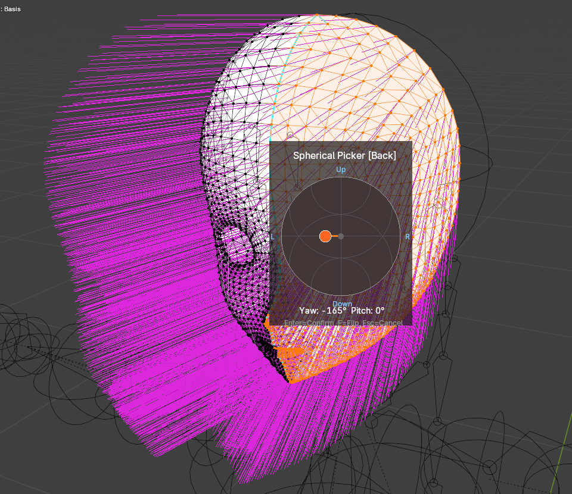

# Local Space Normal Editor

A Blender addon for editing custom normals in local space with an interactive spherical picker.

## Screenshot

## Features

- **Interactive Angle Picker**: Visual XY rectangle widget for intuitive normal direction selection (Yaw/Pitch)
  - Real-time preview - changes apply immediately as you drag
  - 15° angle snapping (optional)
  - Cancel to restore original normals
- **Toon Shading Preview**: Visualize custom normals with toon shading effect
  - Toggle on/off with a button
  - Adjustable light direction (XYZ)
  - Yellow arrow shows current light direction
  - Only visible in Edit Mode
- **Normal Map Baking**: Export custom normals to object-space normal map
  - **Preview & Export**: Check results instantly without saving files
  - **Resolutions**: 512, 1024, 2048, 4096
  - **Edge padding**: Prevent seam artifacts
  - **Post-Smoothing**: Apply blur filter (Box Blur) to soften results
  - **Channel Flipping**: Flip X/Y/Z channels for engine compatibility
- **Persistent Storage**: Custom normals are saved with the .blend file
- **Mirror Editing**: Edit normals symmetrically across X, Y, or Z axis
- **Clear Custom Normals**: Remove custom normals and restore defaults
- **Normal Display Settings**: Quick access to split normal visualization
- **Mark All Sharp**: Utility to set all edges as sharp

## Installation

1. Download the latest release or clone this repository
2. In Blender, go to `Edit > Preferences > Add-ons`
3. Click `Install...` and select the downloaded zip file or the `__init__.py` file
4. Enable the addon by checking the checkbox

## Usage

1. Select a mesh object and enter **Edit Mode**
2. Select the faces you want to modify
3. Open the sidebar (press `N`) and find the **Edit** tab
4. Click **Angle Picker** in the **Local Normal Editor** panel

### Angle Picker Controls

| Action | Description |
|--------|-------------|
| **Drag** on rect | Set yaw/pitch angle (applies immediately) |
| **Enter** | Confirm and close |
| **Esc** | Cancel and restore original normals |

### Tips

- Enable **Snap 15°** for precise angle increments
- Enable **Mirror (X/Y/Z)** to edit both sides symmetrically
- Use **Normal Display** panel to visualize split normals
- Use **Bake Preview** button to check your normal map before exporting

## Requirements

- Blender 4.1 or later

## License

This project is licensed under the GPL-2.0-or-later license. See the [LICENSE](LICENSE) file for details.

## Changelog

### v0.1.0
- **New Feature: Angle Picker**: Replaced Spherical Picker with a simpler Yaw/Pitch Angle Picker
- **New Feature: Bake Preview**: View baked normal map instantly in a new window
- **New Feature: Post-Smoothing**: Add blur filter to bake pipeline
- **UI Overhaul**: Integrated bake settings into the main panel
- Added "Mark All Sharp" operator

## Author

- **shjh3117** - [GitHub](https://github.com/shjh3117)
